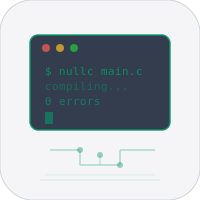
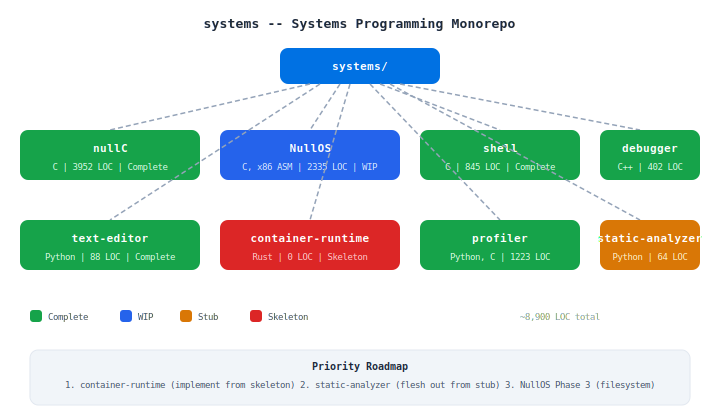

# Systems

Low-level systems programming monorepo. Eight projects spanning compilers, operating systems, shells, debuggers, and more. nullC is the flagship.

## Projects

| Project | Language | LOC | Status | Description |
|---------|----------|-----|--------|-------------|
| [nullC](./nullC) | C | 3952 | Complete | C compiler targeting ARM64 macOS. All 10 levels passing. Peephole optimization |
| [NullOS](./NullOS) | C, x86 ASM | 2335 | WIP | Custom x86 OS from scratch. Two-stage bootloader, protected mode, VGA, shell. Phase 2 done |
| [shell](./shell) | C | 845 | Complete | Unix shell in C99. Pipes, redirects, env vars, builtins, background jobs, signals |
| [debugger](./debugger) | C++ | 402 | Complete | ptrace-based debugger. Breakpoints, single-step, registers, memory read/write |
| [text-editor](./text-editor) | Python | 88 | Complete | Terminal editor (curses). Line numbers, search/replace, undo/redo |
| [container-runtime](./container-runtime) | Rust | 0 | Skeleton | Linux container runtime. Namespaces, cgroups v2, overlay FS planned |
| [profiler](./profiler) | Python, C | 1223 | Complete | CPU profiler (1ms sampling). JSON, text, flame graph output. Decorator API |
| [static-analyzer](./static-analyzer) | Python | 64 | Stub | Python AST analyzer. Unused vars/imports detection. Needs more rules |

## License

MIT 2026 Joshua Trommel
