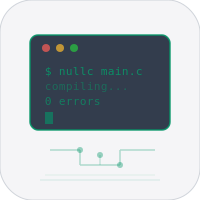

# Systems


Low-level systems programming monorepo. Compilers, operating systems, shells, debuggers, profilers.

## Features

- **nullC** (C) -- C compiler targeting ARM64 macOS. All 10 levels passing. Peephole optimization
- **NullOS** (C, x86 ASM) -- Custom x86 OS. Two-stage bootloader, protected mode, VGA, shell
- **shell** (C) -- Unix shell. Pipes, redirects, env vars, builtins, background jobs, signals
- **debugger** (C++) -- ptrace debugger. Breakpoints, single-step, registers, memory r/w
- **text-editor** (Python) -- Terminal editor. Line numbers, search/replace, undo/redo
- **container-runtime** (Rust) -- Linux container runtime
- **profiler** (Python, C) -- CPU profiler. 1ms sampling, flame graph output
- **static-analyzer** (Python) -- AST analyzer. Unused vars/imports detection

## Run

```bash
# Each project is standalone. See CLAUDE.md for per-project commands.
```

## Roadmap

- [ ] nullC: optimizer passes, more codegen targets
- [ ] NullOS: filesystem, userspace, ELF loader
- [ ] container-runtime: namespaces, cgroups v2, overlay FS

## Changelog

v1.0.0
- Added nullC ARM64 macOS C compiler with all 10 levels passing and peephole optimization
- Built NullOS custom x86 OS with two-stage bootloader, protected mode, VGA, shell
- Implemented Unix shell with pipes, redirects, env vars, builtins, background jobs, signals

## License

MIT 2026 Joshua Trommel
