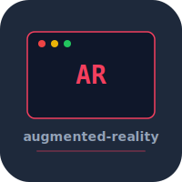

# augmented-reality


ARKit-based augmented reality app built in Swift. Plane detection, object placement, gesture interaction, and 3D rendering with RealityKit.

## Build

```bash
xcodegen generate
open augmented-reality.xcodeproj
```

## Requirements

- iOS 17+
- Xcode 26+
- Physical device with LiDAR (simulator has limited AR)

## License

MIT 2026 Joshua Trommel
