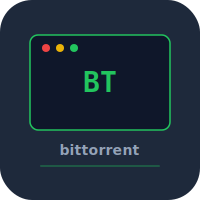

# bittorrent

BitTorrent client built from scratch in Rust. Bencode parser, tracker protocol, peer wire protocol, piece management, and disk I/O.
## Features
- BitTorrent client built from scratch in Rust
- Bencode parser
- Tracker protocol
- Peer wire protocol
- Piece management
- Disk I/O
## Run
```bash
cargo build --release
./target/release/bittorrent download file.torrent
cargo test
```
## Roadmap
- [ ] Support magnet links
- [ ] Piece prioritization by file in multi-file torrents
- [ ] Peer choking/unchoking strategies for better throughput
## Changelog
- v0.1.0
  - Built a BitTorrent client in Rust
  - Implemented bencode parsing and .torrent file handling
  - Added tracker, peer wire, piece management, and disk I/O
## License
MIT 2026 Joshua Trommel
