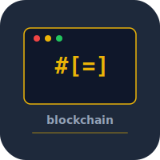

# blockchain


Proof-of-work blockchain built from scratch in Rust. Blocks, transactions, mining, mempool, and peer-to-peer networking.

## Build

```bash
cargo build --release
./target/release/blockchain node --port 8333
```

## Test

```bash
cargo test
```

## License

MIT 2026 Joshua Trommel
