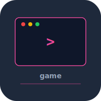

# game


Terminal game engine and roguelike game built from scratch in C. Renders with ncurses, entity-component architecture, procedural map generation.

## Build

```bash
make
./game
```

## Controls

- Arrow keys / WASD -- movement
- Q -- quit

## Test

```bash
make test
```

## License

MIT 2026 Joshua Trommel
