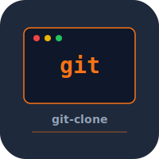

# git-clone


Git version control system internals implemented from scratch in C. Object store, index, refs, packfiles, diff, and merge.

## Build

```bash
make
./mygit init
./mygit add file.txt
./mygit commit -m "initial"
```

## Test

```bash
make test
```

## License

MIT 2026 Joshua Trommel
