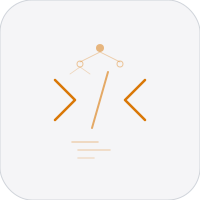

# jot


A scripting language with Python (reference) and C99 (production) interpreters.

## Features

- Variables, functions with defaults, lexical closures, classes
- Arrays, objects, string interpolation, try/catch/throw
- Destructuring: `let [a, b, ...rest] = arr`, `let {x, y} = obj`
- Control flow: if/else, while, for-in, break, continue, ternary
- 54 builtins: math, string, array, object, type, functional, file I/O
- Import system with circular prevention
- Cross-runtime parity test suite
- Source formatter (`tools/fmt.py`)

## Run

```bash
# Python
PYTHONPATH=. python3 python/main.py examples/hello.jot
PYTHONPATH=. python3 -m pytest python/tests/

# C
make -C src/
src/jot examples/hello.jot
make -C src/ test

# Parity
bash tests/parity/run_parity.sh
```

## Roadmap

- [ ] stdlib expansion, editor support, import/module rules
- [ ] Better diagnostics, optimization passes
- [ ] Self-hosting components, package system

## Changelog

- v5.0.0
  - Added array destructuring syntax
  - Added rest syntax for array patterns
  - Added object destructuring syntax

## License

MIT 2026 Joshua Trommel
