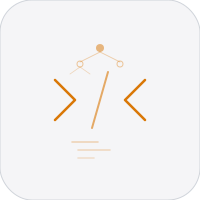

# jot


A scripting language with two implementations: Python (reference) and C99 (production). This repository is the canonical `jot` root; legacy merged-project directories have been removed. Brace-delimited blocks, optional semicolons, both `//` and `#` comments.

## Features

- Variables with `let`, functions with default params, first-class closures
- Classes with constructors (`init`), instance variables (`this`), methods
- Arrays, objects, string interpolation (`"hello ${name}"`)
- Control flow: if/else/else-if, while, for-in, break, continue, ternary
- Compound assignment (`+=`, `-=`, `*=`, `/=`), unary operators
- Try/catch/throw exception handling with nested support
- 54 builtin functions: math (abs, sqrt, pow, floor, ceil, round, min, max), string (upper, lower, trim, contains, replace, indexOf, split), array (push, pop, sort, reverse, slice, join, includes, indexOf, flat, concat), object (keys, values, has), type/conversion (type, str, int, parse, stringify), functional (map, filter, reduce), file I/O (read, write, append)
- Import system with circular import prevention
- Dual implementation: Python reference interpreter + C99 production runtime
- 21 example programs, 151 tests across 6 test suites
- Call depth cap at 200, scope depth limits, refcounted memory (C)

## Quick Start

```bash
# Python interpreter
PYTHONPATH=. python3 python/main.py examples/hello.jot

# C interpreter
make -C src/
src/jot examples/hello.jot

# REPL
src/jot
```

## Repository

- GitHub: `nulljosh/jot`
- Single-project layout: root `python/`, `src/`, `examples/`, `docs/`
- Legacy `langs` / `jit` / `query-language` subprojects removed

## Hello World

```
let name = "world"
print "hello ${name}"

fn greet(who, greeting = "hi") {
    return "${greeting}, ${who}!"
}
print greet("jot")
```

## Testing

```bash
# Python (151 tests)
PYTHONPATH=. python3 -m pytest python/tests/

# C (11 test suites)
make -C src/ test
```

## Checkpoints

### Current Status

- `jot` is a real small language now, not just a parser demo
- Two implementations exist: Python reference interpreter and C99 runtime
- Core language features are in place: functions, classes, arrays, objects, imports, exceptions, builtins
- The project is in the "make it coherent and durable" phase rather than the "add obvious syntax" phase

### What Is Working

- Python test suite is broad and exercises most language features
- C test suite passes across the existing `.jot` fixture set
- The repo structure is clean and the examples are good enough to teach the language

### Biggest Roadblocks

- No formal language spec yet
- Python and C runtimes can still drift semantically
- Lexical closure behavior is still a key area to finish and lock down across runtimes
- Tooling is still thin: no formatter, no editor integration, no strong diagnostics story
- No benchmark discipline yet, so performance claims are still anecdotal

### Next Bar For An A+ Project

- True lexical closures with consistent scope semantics
- Cross-runtime parity tests for the same programs
- A short written language spec
- Better error messages with stable formatting
- A benchmark set for startup, parsing, loops, strings, arrays, objects, JSON, and imports
- Basic tooling: formatter first, editor support second

### Short Roadmap

- `v4.1`: closure semantics, parity work, doc cleanup, error cleanup
- `v4.2`: formatter, import/module rules, better diagnostics
- `v4.3`: stdlib expansion, benchmarks, editor support

## Structure

```
python/          # Python reference interpreter
  lexer.py       # Tokenizer
  parser.py      # Recursive descent parser
  interpreter.py # Tree-walk evaluator
  main.py        # CLI + REPL entry point
  tests/         # pytest suite
src/             # C99 production interpreter
  lexer.c/h      # Tokenizer
  parser.c/h     # Recursive descent parser
  interpreter.c/h # Tree-walk evaluator
  value.c/h      # Refcounted value types
  table.c/h      # Hash table (FNV-1a)
  builtins.c/h   # Standard library
  main.c         # CLI + REPL
  Makefile
  tests/         # .jot test files + .expected
examples/        # Example programs
docs/            # Language documentation
```

## License

MIT 2026 Joshua Trommel
