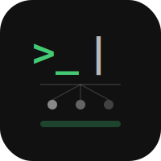
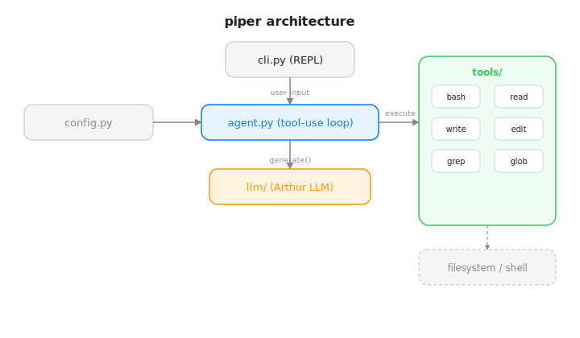

# Piper


CLI coding assistant powered by Arthur LLM. A from-scratch alternative to Claude Code, running on a custom transformer model.

## Architecture



## Install

```bash
cd ~/Documents/Code/piper
pip install -e .
```

## Usage

```bash
piper
```

Type at the `piper>` prompt. `/quit` to exit.

## Tools

| Tool | Description |
|------|-------------|
| bash | Shell command execution |
| read | File reader with offset/limit |
| write | File writer |
| edit | Find/replace in files |
| grep | Regex search (ripgrep) |
| glob | File pattern matching |

## Status

Scaffolding complete. Arthur LLM integration pending -- model needs coherent text generation before tool-use can be wired in.

## License

MIT 2026 Joshua Trommel
