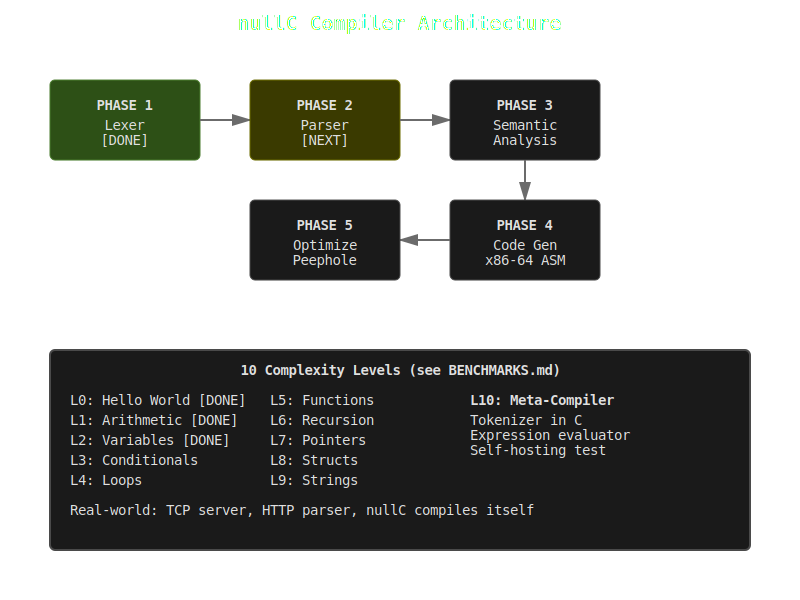

# nullC

A minimal C compiler written in C. Educational project.



## Status

**Working:** Lexer, parser, codegen all functional

**Test Results (ARM64):**
- Level 0-10: All levels passing (structs with nested members now working)

**Compilation Pipeline:**
```
C source → Lexer → Parser → AST → ARM64 Assembly → Binary
```

## Quick Start

```bash
# Build compiler
make

# Compile a program
./nullc examples/level0_hello.c

# Run compiled binary
./level0_hello

# Check exit code
echo $?
```

## Test All Levels

```bash
for f in examples/level*.c; do
  ./nullc "$f" && ./${f%.c} && echo "Exit: $?"
done
```

<details>
<summary><strong>Complexity Levels</strong></summary>

### Level 0: Hello World
Empty main function returning 0
- **Status**: Compiles and runs

### Level 1: Arithmetic
Basic math operations (+, -, *, /)
- **Status**: Returns 48

### Level 2: Variables
Variable declarations and assignments
- **Status**: Returns 115

### Level 3: Conditionals
if/else statements, comparison operators
- **Status**: Returns 2

### Level 4: Loops
for and while loops, loop control flow
- **Status**: Returns 55

### Level 5: Functions
Function definitions, calls with parameters, return values
- **Status**: Returns 27

### Level 6: Recursion
Recursive function calls (factorial, fibonacci)
- **Status**: Returns 133

### Level 7: Pointers & Arrays
Array indexing, pointer arithmetic
- **Status**: Compiles successfully

### Level 8: Structs
Struct definitions, nested structs, member access
- **Status**: Returns 50

### Level 9: Strings
String manipulation, character arrays
- **Status**: Compiles successfully

### Level 10: Meta-Compiler
Tokenizer and expression evaluator written in C
- **Status**: Compiles successfully (compiler writing a compiler!)

</details>

<details>
<summary><strong>Architecture</strong></summary>

### Implementation Phases

#### Phase 1: Lexer [DONE]
- Tokenize C source
- Recognize keywords, identifiers, numbers, operators
- Handle whitespace and newlines

#### Phase 2: Parser [COMPLETE]
- Build Abstract Syntax Tree (AST)
- Handle expressions, statements, declarations
- Operator precedence
- **Status**: Fully functional, all levels parse correctly

#### Phase 3: Semantic Analysis [PARTIAL]
- Type checking
- Symbol table (implemented)
- Scope resolution (basic)

#### Phase 4: Code Generation [IN PROGRESS]
- Generate ARM64 assembly (Darwin/macOS)
- Register allocation (basic)
- Function calling conventions (AAPCS64)
- **Status**: Levels 0-10 all compile and run correctly

#### Phase 5: Optimization [IMPLEMENTED]
- Peephole optimization (redundant instruction removal)
- Future: Constant folding, dead code elimination

</details>

<details>
<summary><strong>Peephole Optimization</strong></summary>

### What It Does
Removes redundant instruction pairs from generated ARM64 assembly.

**Pattern detected:**
```asm
str xN, [sp, #-16]!   # Store register to stack
ldr xN, [sp], #16     # Immediately load same register from stack
```

This is a no-op (store then load with no useful work between).

### Results

| Level | Description | Pairs Removed |
|-------|-------------|---------------|
| 0 | Hello World | 0 |
| 1 | Arithmetic | 0 |
| 2 | Variables | 0 |
| 3 | Conditionals | 0 |
| 4 | Loops | 0 |
| 5 | Functions | 0 |
| 6 | Recursion | **5** |
| 7 | Pointers | 0 |
| 8 | Structs | **1** |
| 9 | Strings | **1** |
| 10 | Meta-Compiler | **3** |

**Total:** 10 redundant instruction pairs removed

### Impact
- **Fewer instructions:** 10 fewer instructions across test suite
- **Correctness:** All tests still pass with expected exit codes
- **Code quality:** Cleaner assembly output

### Usage
```bash
./nullc examples/level6_recursion.c
# Output: Peephole: removed 5 redundant instruction pair(s)
```

### Conservative Approach
Only removes **true no-ops** where:
- Same register is stored then loaded
- No useful instructions between store/load
- Immediate stack push/pop pattern

This is a **teaching tool**, not a production optimizer.

</details>

<details>
<summary><strong>Optimization Opportunities</strong></summary>

### Current State
- Working compiler, all 10 levels passing
- ARM64 output is correct but not optimized
- Heavy use of stack for temporaries (should use registers)

### Low-Hanging Fruit

#### 1. Peephole Optimization [DONE]
Remove redundant patterns (store/load pairs)

#### 2. Register Allocation (Medium, 4-8 hours)
Currently uses only x0 for expressions. Could use x0-x7 for temporaries.

**Benefits:**
- Fewer memory operations
- ~2-3x faster code
- More like real compilers

#### 3. Constant Folding (Easy, 1 hour)
Evaluate at compile time:
```c
int x = 5 + 3;  // Could emit: mov x0, #8
```

#### 4. Dead Code Elimination (Medium, 2-4 hours)
Remove unused variables and unreachable code.

#### 5. Strength Reduction (Easy, 1 hour)
Replace expensive ops:
```c
x * 2   →  x << 1   (shift is faster than multiply)
x / 4   →  x >> 2
```

### Performance Baseline

Test with level1_arithmetic.c:
```bash
time ./level1_arithmetic
```

Current: ~0.001s (dominated by process startup)

Measure with:
```bash
./nullc examples/level1_arithmetic.c
wc -l examples/level1_arithmetic.s  # Count assembly lines
```

### Why Not Essential

nullC is a learning project. The code is:
- Correct (all tests pass)
- Readable (easy to understand)
- Complete (handles all features)

Optimization is educational but not required for the project goals.

Real-world C compilers (gcc, clang) have thousands of optimization passes built over decades. We'd never match them, nor should we try.

### Focus

Focus on **one clear optimization** that teaches something, rather than trying to be "production ready."

Peephole optimization is perfect:
- Easy to implement
- Teaches pattern matching
- Visible results
- Doesn't break existing code

</details>

<details>
<summary><strong>Example Programs</strong></summary>

### Level 0: Hello World
```c
int main() {
    return 0;
}
```

### Level 6: Recursion
```c
int fib(int n) {
    if (n <= 1) return n;
    return fib(n-1) + fib(n-2);
}

int main() {
    return fib(10);  // Returns 55
}
```

### Level 8: Structs
```c
struct Point {
    int x;
    int y;
};

int main() {
    struct Point p;
    p.x = 10;
    p.y = 20;
    return p.x + p.y;  // Returns 30
}
```

### Level 10: Meta-Compiler
```c
// A tokenizer written in C, compiled by nullC!
int tokenize(char* source) {
    // Implementation...
}

int main() {
    return tokenize("1 + 2 * 3");
}
```

See `examples/` directory for full programs.

</details>

<details>
<summary><strong>Build System</strong></summary>

### Makefile
```bash
make          # Build compiler
make clean    # Remove generated files
make test     # Run all level tests
```

### Manual Build
```bash
# Compile the compiler
gcc -O2 src/*.c -o nullc

# Compile a program
./nullc examples/level0_hello.c

# Assemble and link (macOS ARM64)
as examples/level0_hello.s -o examples/level0_hello.o
ld -o level0_hello examples/level0_hello.o -lSystem -syslibroot `xcrun --show-sdk-path` -e _main -arch arm64

# Run
./level0_hello
```

</details>

## Documentation

- **README.md** - This file (complete feature reference)
- **CLAUDE.md** - Development notes and architecture
- **map.svg** - Visual project map

## Goal

Compile all 10 complexity levels from C source → working binaries on ARM64 macOS.

**Status:** Complete (all levels passing)

## Author

Joshua Trommel ([@nulljosh](https://github.com/nulljosh))

## License

MIT

---

**Built for learning.** This is a minimal, educational C compiler. Not for production use.
