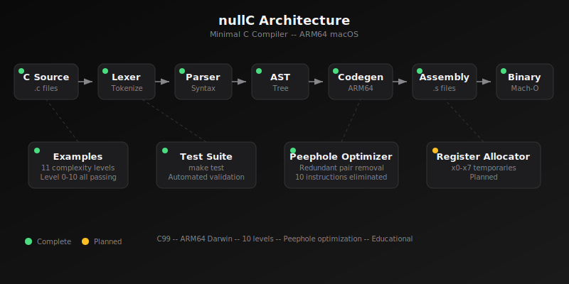

# nullC

A minimal C compiler written in C. Compiles C source to ARM64 assembly on macOS.



## Status

All 11 complexity levels (0-10) compile and run correctly.

```
C source -> Lexer -> Parser -> AST -> Codegen -> ARM64 Assembly -> Binary
```

## Quick Start

```bash
make                              # Build compiler
./nullc examples/level0_hello.c   # Compile a program
./level0_hello                    # Run it
make test                         # Run all tests
```

## Complexity Levels

| Level | Feature | Exit Code |
|-------|---------|-----------|
| 0 | Hello World | 0 |
| 1 | Arithmetic | 48 |
| 2 | Variables | 115 |
| 3 | Conditionals | 2 |
| 4 | Loops | 55 |
| 5 | Functions | 27 |
| 6 | Recursion | 133 |
| 7 | Pointers & Arrays | -- |
| 8 | Structs | 50 |
| 9 | Strings | -- |
| 10 | Meta-Compiler | -- |

## Peephole Optimizer

Removes redundant store/load pairs from generated ARM64 assembly. 10 instruction pairs eliminated across the test suite (levels 6, 8, 9, 10). Conservative approach: only removes true no-ops where the same register is stored then immediately loaded with no useful work between.

```bash
./nullc examples/level6_recursion.c
# Output: Peephole: removed 5 redundant instruction pair(s)
```

## Architecture

| Phase | Status |
|-------|--------|
| Lexer | Complete |
| Parser | Complete |
| Semantic Analysis | Partial (symbol table, basic scoping) |
| Code Generation (ARM64) | Complete (all levels) |
| Peephole Optimization | Complete |

## Roadmap

- Register allocation (x0-x7 for temporaries instead of stack-heavy codegen)
- Constant folding (compile-time evaluation of constant expressions)
- Dead code elimination
- Self-hosting test (compile nullC with nullC)

## License

MIT 2026 Joshua Trommel
