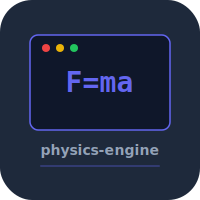

# physics-engine


2D rigid body physics engine built from scratch in C. Broad/narrow phase collision detection, constraint solver, Verlet integration.

## Build

```bash
make
./physics_demo
```

## Test

```bash
make test
```

## License

MIT 2026 Joshua Trommel
