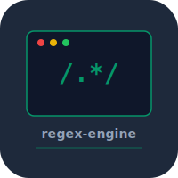

# regex-engine


Regex compiler and matching engine built from scratch in C. Implements Thompson's construction for NFA, subset construction for DFA conversion, and both NFA/DFA-based matching.

## Features

- Pattern parsing with full regex syntax (`.`, `*`, `+`, `?`, `|`, `()`, `[]`)
- Thompson NFA construction
- NFA to DFA conversion via subset construction
- Configurable matching backends

## Build

```bash
make
./regex "pattern" "input"
```

## Test

```bash
make test
```

## License

MIT 2026 Joshua Trommel
