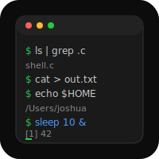

# Shell


A Unix shell built from scratch in C99 -- command parsing, execution, piping, redirects, and job control.

## Build & Run

```bash
make
./shell
```

## Features
- REPL with prompt (`~/` home substitution)
- Command parsing with single/double quote support
- Environment variable expansion (`$VAR`, inside double quotes too)
- Pipes (`ls | grep .c | wc -l`)
- Redirects (`>`, `>>`, `<`)
- Builtins: `cd`, `exit`, `export`, `history`, `fg`, `bg`
- Background jobs (`sleep 10 &`)
- Signal handling (SIGINT/SIGTSTP ignored in parent, forwarded to children)

## Architecture

```
Input -> Tokenizer -> Pipeline Builder -> Executor -> Output
              |               |                |
         quotes, $VAR    redirects         fork/exec/pipe
         expansion       parsed here       dup2 for I/O
```

Single file: `src/shell.c` (~470 lines C99, zero dependencies beyond POSIX).

## Tests

```bash
make && bash tests/test_shell.sh
```

## Architecture

See [architecture.svg](architecture.svg) for a visual overview.
