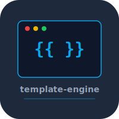

# template-engine


Jinja-style template compiler built from scratch in Python. Supports variables, conditionals, loops, filters, and template inheritance.

## Features

- `{{ variable }}` interpolation
- `` / `` control flow
- `{{ value | filter }}` filter pipeline
- Template inheritance with `` / ``

## Usage

```bash
pip install -r requirements.txt
python -m template_engine render template.html data.json
```

## Test

```bash
python -m pytest tests/
```

## License

MIT 2026 Joshua Trommel
