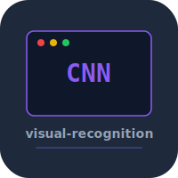

# visual-recognition


Image classifier built from scratch in Python using only NumPy. Convolutional neural network with forward/backward pass, no deep learning frameworks.

## Usage

```bash
pip install -r requirements.txt
python -m visual_recognition train --data cifar10 --epochs 10
python -m visual_recognition classify image.png
```

## Test

```bash
python -m pytest tests/
```

## License

MIT 2026 Joshua Trommel
