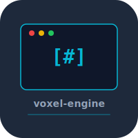

# voxel-engine


Voxel renderer built from scratch in Rust. Chunk-based world, greedy meshing, OpenGL rendering, procedural terrain generation.

## Build

```bash
cargo build --release
./target/release/voxel-engine
```

## Controls

- WASD -- movement
- Mouse -- camera look
- Space/Shift -- up/down

## Test

```bash
cargo test
```

## License

MIT 2026 Joshua Trommel
